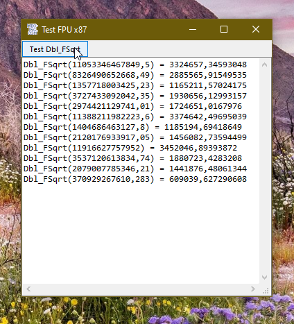

# Asm_FPUx87  
## Some FPU x87 functions made available for VB  

 

Project started in march 2024.  
You can develop functions using the FPU in assembler and call it in VB from a dll.
The dll now contains only the fsqrt-function. However using the function VBA.Math.Sqr is twice as fast.

